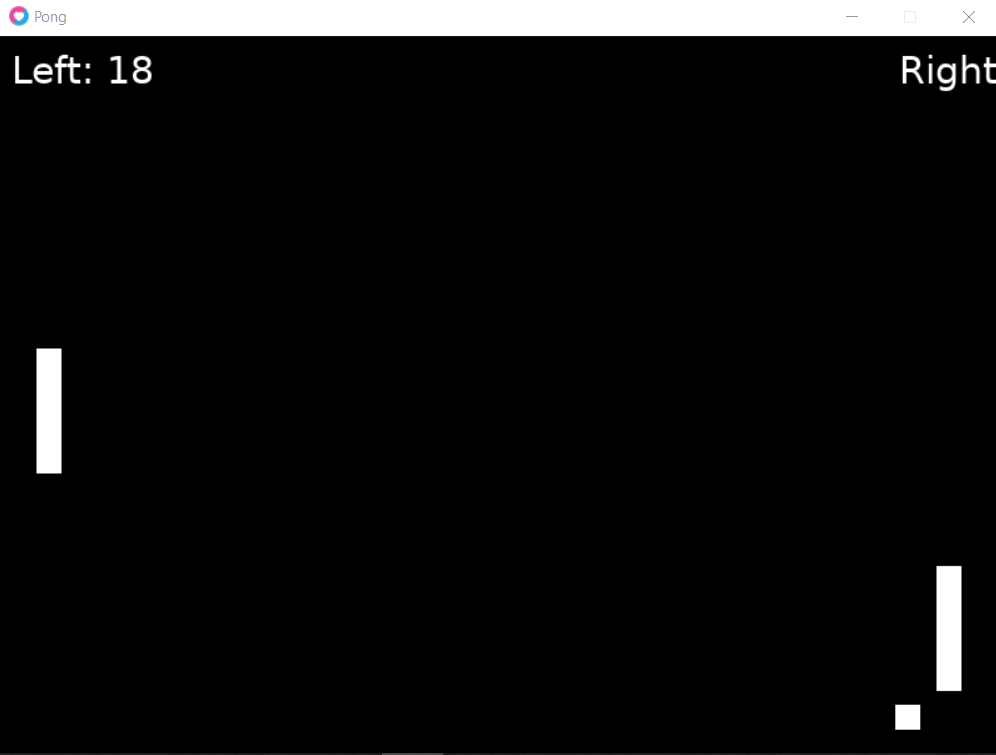

# PONG COM LOVE
👨‍💻PROJETO CRIADO PARA O CURSO DE LOVE.

 <br>

## DESCRIÇÃO:
**Pong** é um clássico jogo de arcade lançado em 1972 e considerado um dos primeiros jogos eletrônicos a ganhar popularidade. O jogo é uma simulação simplificada de tênis de mesa (pingue-pongue), onde dois jogadores controlam paddles (raquetes) para rebater uma bola e tentar marcar pontos contra o adversário.

O objetivo do jogo é marcar pontos fazendo com que a bola passe pelo paddle (raquete) do adversário. Cada jogador controla um paddle que pode se mover verticalmente ao longo de um lado da tela. A bola se move pela tela e deve ser rebatida pelo paddle do jogador para evitar que ela saia pela borda do campo de jogo.

## COMO JOGAR?
- **Execute o Jogo**: 
   - Execute o LÖVE apontando para a pasta do seu projeto `(./main.lua)`:

   ```bash
   love .
   ```

   - Isso deve abrir uma janela do LÖVE com o jogo do PONG.

- **Regras**:
  - A bola se move continuamente pela tela.
  - Se a bola colidir com o paddle de um jogador, ela inverte a direção e continua se movendo.
  - Se a bola colidir com a borda superior ou inferior da tela, ela também inverte a direção.
  - Se a bola passar pelo paddle de um jogador e sair pela borda lateral da tela, o adversário marca um ponto.
  - O jogo reinicia a posição da bola no centro da tela após cada ponto.

- **Movimentação do Paddle Esquerdo**:
  - **`W`**: Move o paddle esquerdo para cima.
  - **`S`**: Move o paddle esquerdo para baixo.

- **Movimentação do Paddle Direito**:
  - **`Setas para cima`**: Move o paddle direito para cima.
  - **`Setas para baixo`**: Move o paddle direito para baixo.

- **Objetivo do Jogo**:
  - Rebata a bola com seu paddle para evitar que ela passe pelo seu lado da tela.
  - Marque pontos quando a bola passar pelo paddle adversário.
  - O jogo continua até que você feche a janela do jogo.

## CREDITOS:
- [PROJETO CRIADO PARA O CURSO DE LOVE](https://github.com/VILHALVA/CURSO-DE-LOVE)
- [PROJETO CRIADO PELO VILHALVA](https://github.com/VILHALVA)
